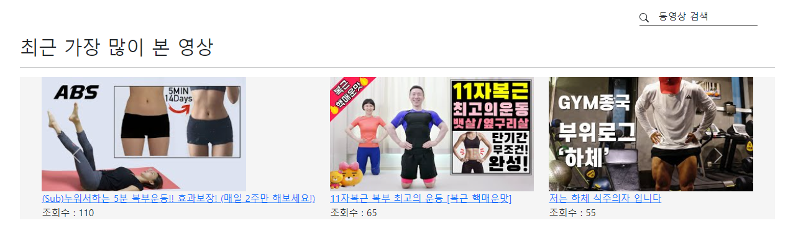
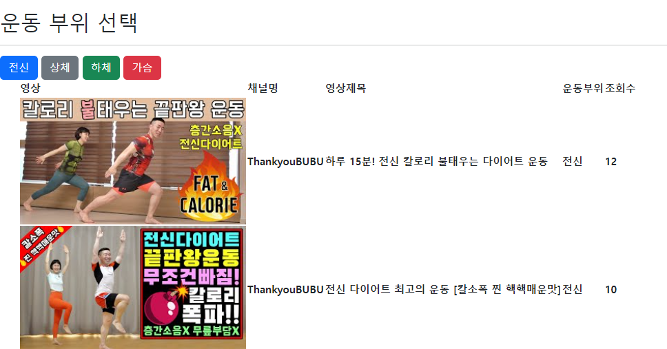
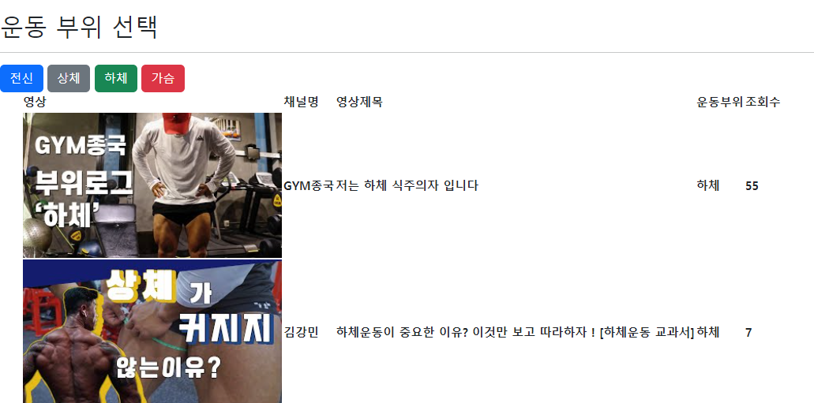
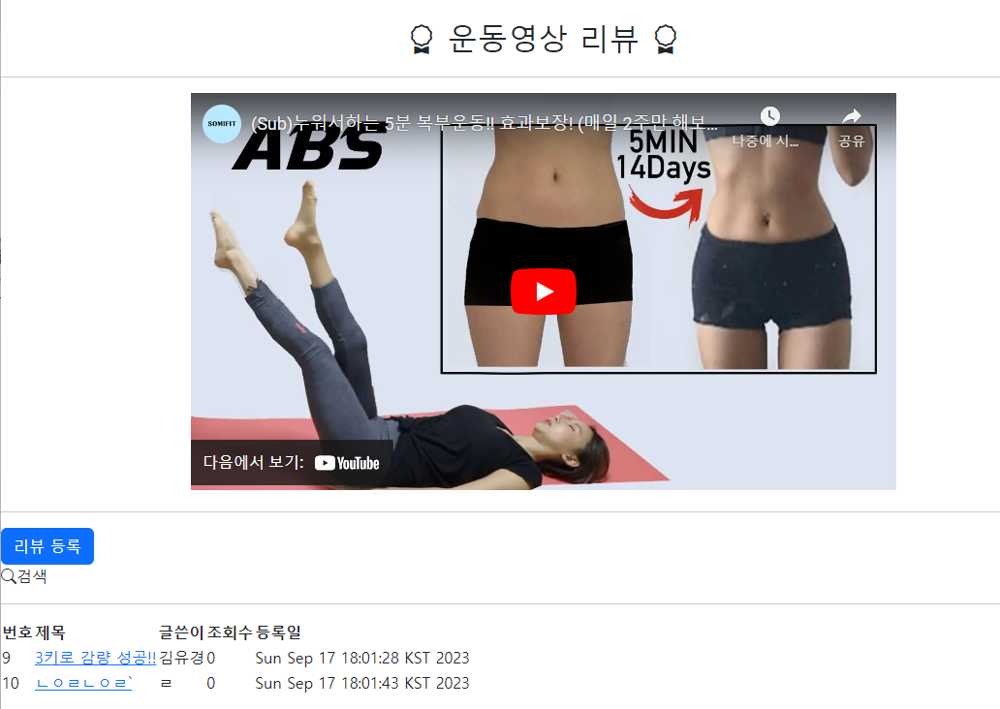
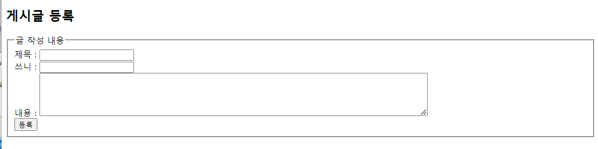
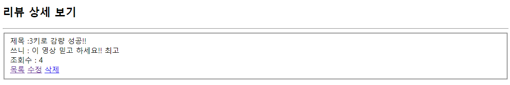

## 🎬 230915 백엔트 프로젝트

## ✔ 작성 정보

- 작성자: 김유경
- 날짜: 2023.09.15(금)

## ✔ 프로젝트 목표

- Java의 BackEnd 기술인 Servlet/JSP를 이해하고 이를 활용하여 웹 서버를 구축 할
  수 있다.
- MVC 구조를 이해하고 이를 활용하여 프로그램을 작성 할 수 있다.
- FrontEnd 관통 프로젝트를 참고하여 화면과 연계가 필요한 부분의 BackEnd를 완성한다.

## ✔ 프로젝트 요구사항

- Ssafit 프로젝트의 BackEnd 파트를 구현하는 것을 목표로 한다. MVC 기반의 웹
  프로젝트를 설계하고 구현하여 보자.
- 백앤드 데이터 관리는 이전 자바관통에서 진행한 것처럼 메모리를 활용하여
  진행한다. 소스 작성 전 작성하려는 BackEnd 클래스의 구조와 네이밍룰 등을
  검토하여 완성도 높은 결과물이 나오는 것을 목표로 하자.

1.  백앤드 구현시 이클립스를 이용하여 구현한다.
2.  기능 구현

    (1) 기본기능

         다양한 운동영상정보와 영상의 리뷰를 위한 백앤드 기능을 구현한다.

         메인페이지 백앤드 기능 구현
         : 운동 영상 정보의 다양한 출력을 위한 백앤드 구현(조회수 기준 영상 운동부위별 영상)

         운동영상에 대한 리뷰관리 백앤드 기능 구현
         : 목록, 등록, 수정, 상세, 삭제

## ✔ 프로젝트 Diagram

## 📂 폴더 구조

```
📂 Java Resources
    ㄴ 📂 src
        ㄴ 📂 com.ssafy.fit.model
            ㄴ 📂 controller
                ㄴ 📄 MainController.java
            ㄴ 📂 dao
                ㄴ 📄 MainDao.java
                ㄴ 📄 MainDaoImpl.java
            ㄴ 📂 dto
                ㄴ 📄 Video.java
            ㄴ 📂 service
                ㄴ 📄 MainService.java
                ㄴ 📄 MainServiceImpl.java
        ㄴ 📂 com.ssafy.review
            ㄴ 📂 controller
                ㄴ 📄 ReviewController.java
            ㄴ 📂 model.dao
                ㄴ 📄 ReviewDao.java
                ㄴ 📄 ReviewDaoImpl.java
            ㄴ 📂 model.dto
                ㄴ 📄 Review.java
            ㄴ 📂 model.service
                ㄴ 📄 ReviewService.java
                ㄴ 📄 ReviewServiceImpl.java
📂 WebContent
    ㄴ 📂 img
        ㄴ 🎨 mainImg.png
        ㄴ 🎨 ssafit.png
    ㄴ 📂 main
        ㄴ 📄 list.jsp
    ㄴ 📂 review
        ㄴ 📄 detail.jsp
        ㄴ 📄 list.jsp
        ㄴ 📄 updateform.jsp
        ㄴ 📄 writeform.jsp
    ㄴ 📂 WEB-INF
        ㄴ 📂 lib
            ㄴ 💾 jstl-1.2jar
    ㄴ 📄 app.css
    ㄴ 📄 index.html
    ㄴ 📄 style.css

```
#### com.ssafy.fit.model


<br>

#### com.ssafy.review.model


<br>
<br>

## 🖥 구현 이미지 - 조회수 순 정렬

지정된 조회수별로 가장 많이 본 영상을 순서대로 구현했습니다.
<br>
<br>


## 🖥 구현 이미지 - 운동부위별 정렬
### 운동 부위별로 버튼을 눌렀을 때 해당 영상만 나오게 구현
#### 전신


<br>

#### 하체



## 🖥 구현 이미지 - 상세페이지
### 영상을 눌렀을 때 해당 영상이 나오고, 밑에 리뷰 게시판이 나온다.


<br>

## 🖥 구현 이미지 - 리뷰 관리
### 리뷰를 등록할 수도 있다.



### 리뷰를 상세 확인하며 조회수를 늘릴 수 있다.


### 내용을 수정하거나 삭제할 수도 있다.


<br>

## ✔ 소감

### 1) back 구현
복습을 나름 한다고 했는데, 실전에 돌입하니 어느 것을 어떻게 사용해야 할지 감이 안왔다. 개념과 현실 적용 사이의 괴리를 줄이려면 어떻게 해야 할지 고민해보는 계기가 되었다.
영상 별로 페이지를 각각 관리하는 것을 지난 번 프론트 할 때 구현했었는데, 이를 새롭게 다시 하려니, JSP, HTML 사이에서 어떻게 조정해야 할지 생각하면서 더 나은 구현방법에 대해 생각해 볼 수 있었다.

### 2) 프론트적
백엔드 기본 구현을 완성한 후에 프론트를 진행하려고 보니, 어떻게 만들면 더 가독성있는 페이지를 만들 수 있을지에 대한 감이 전혀 오지 않아서, 이는 앞으로 공부해나가면서 더 많은 페이지를 열어보고, 더 많은 코드를 읽어보면서 성장해나갈 부분인 것 같다.

<br>


## 🙋🏻‍♀️ 추가로 구현할 것!

### 1. 회원가입, 로그인 기능

- 회원가입 백엔드 구현
- 로그인, 로그아웃 백엔드 구현


### 2. 영상 찜, 찜 삭제
회원은 관심있는 영상을 찜 할수도 있고 찜한 영상을 삭제할 수도 있다.
회원은 다른 회원을 팔로우 할 수 있다.

- 회원의 팔로우 정보 관리 백엔드 구현
- 회원의 영상 찜 관리 백엔드 구현
