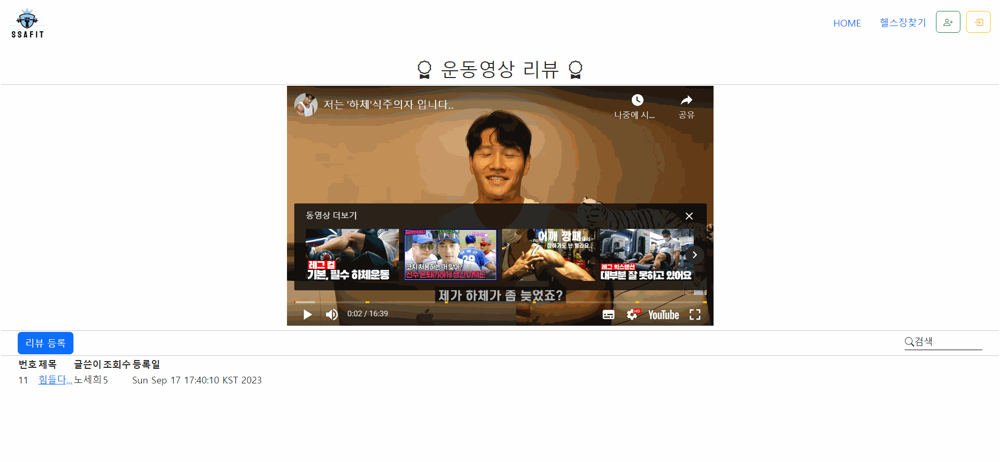
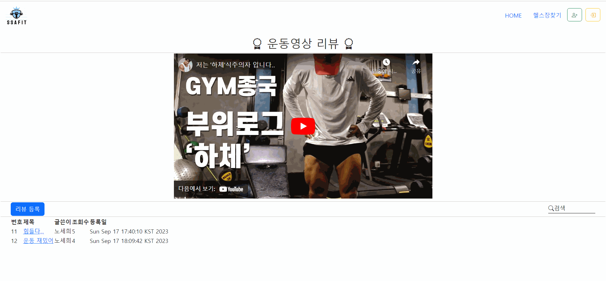

# 🎬 PJT3-D

<br>

**✔ 작성 정보**

작 성 자 : 서울 7반

날 짜 : 2023-09-15

환 경 : Windows 10 Pro

개발도구 : Eclipse Java EE

언어 : Java

<br>

✔ **프로젝트 요구사항**

- Ssafit 프로젝트의 BackEnd 파트를 구현하는 것이 목표
  - MVC 기반의 웹 프로젝트를 설계하고 구현
- 백앤드 데이터 관리는 이전 자바 관통에서 진행한 것처럼 메모리를 활용하여 진행
  - 소스 작성 전 작성하려는 BackEnd 클래스의 구조와 네이밍룰 등을 검토하여 완성도 높은 결과물이 나오는 것이 목표
- 백앤드 구현시 이클립스를 이용하여 구현
- 기능 구현
  1. 기본 기능
     - 다양한 운동영상정보와 영상의 리뷰를 위한 백앤드 기능을 구현
     - 메인페이지 백앤드 기능 구현 <br>
       : 운동 영상 정보의 다양한 출력을 위한 백앤드 구현(조회수 기준 영상, 운동부위별 영상)
     - 운동영상에 대한 리뷰관리 백앤드 기능 구현<br>
       : 목록, 등록, 수정, 상세, 삭제
  2. 추가 기능
     - 사이트의 다양한 기능을 사용하기 위해 회원가입, 로그인 기능을 제공
       - 회원가입 백앤드 구현
       - 로그인, 로그아웃 백앤드 구현
  3. 심화 기능
     - 회원은 관심있는 영상을 찜 할 수 있고 찜한 영상 삭제 가능
     - 회원은 다른 회원을 팔로우 할 수 있음
       - 회원의 팔로우 정보 관리 백앤드 구현
       - 회원의 영상 찜 관리 백앤드 구현

<br>

✔ **프로젝트 목표**

- Jva의 BackEnd 기술인 Servlet/JSP를 이해하고 이를 활용하여 웹 서버 구축 가능
- MVC 구조를 이해하고 이를 활용하여 프로그램 작성 가능
- FrontEnd 관통 프로젝트를 참고하여 화면과 연계가 필요한 부분의 BackEnd를 완성

<br>

## 📂 폴더 구조

```
📂 Java Resources
    ㄴ 📂 src
        ㄴ 📂 com.ssafy.fit.model
            ㄴ 📂 controller
                ㄴ 📄 MainController.java
            ㄴ 📂 dao
                ㄴ 📄 MainDao.java
                ㄴ 📄 MainDaoImpl.java
            ㄴ 📂 dto
                ㄴ 📄 Video.java
            ㄴ 📂 service
                ㄴ 📄 MainService.java
                ㄴ 📄 MainServiceImpl.java
        ㄴ 📂 com.ssafy.review
            ㄴ 📂 controller
                ㄴ 📄 ReviewController.java
            ㄴ 📂 model.dao
                ㄴ 📄 ReviewDao.java
                ㄴ 📄 ReviewDaoImpl.java
            ㄴ 📂 model.dto
                ㄴ 📄 Review.java
            ㄴ 📂 model.service
                ㄴ 📄 ReviewService.java
                ㄴ 📄 ReviewServiceImpl.java
📂 WebContent
    ㄴ 📂 img
        ㄴ 🎨 mainImg.png
        ㄴ 🎨 ssafit.png
    ㄴ 📂 main
        ㄴ 📄 list.jsp
    ㄴ 📂 review
        ㄴ 📄 detail.jsp
        ㄴ 📄 list.jsp
        ㄴ 📄 updateform.jsp
        ㄴ 📄 writeform.jsp
    ㄴ 📂 WEB-INF
        ㄴ 📂 lib
            ㄴ 💾 jstl-1.2jar
    ㄴ 📄 app.css
    ㄴ 📄 index.html
    ㄴ 📄 style.css

```

<br>

## 🔹 Class Diagram

**📑 Video 관련 Class Diagram**
<br>


- MainController.java
- MainDao.java
- MainDaoImpl.java
- Video.java
- MainService.java
- MainServiceImpl.java

<br>

**📑 Review 관련 Class Diagram**
<br>


- ReviewController.java
- ReviewDao.java
- ReviewDaoImpl.java
- Review.java
- ReviewService.java
- ReviewServiceImpl.java

<br>

## 🔹 구현 결과

**🖥 메인 화면**
<br>


- 메인화면 front 관통 프로젝트 때 구현했던 부분을 살짝 변형시켜 만든 메인 화면.
- 메인 페이지의 body 부분은 조회수 기준으로 배치된 최근 가장 많이 본 영상 파트와 운동 부위 기준으로 클릭하여 확인할 수 있는 운동 부위 선택 파트로 나뉘어져 있다.

**🖥 조회수 기준 & 운동 부위 기준 정렬 화면**
<br>


- 조회수 기준 정렬: 조회수가 높은 순서가 왼쪽으로 오도록 구현
- 운동 부위 기준 정렬: 전신, 상체, 하체, 가슴 중 원하는 버튼을 클릭하면 해당 영상만 나오도록 구현

**🖥 상세 영상 및 리뷰 목록**
<br>


- 메인 화면에 있는 영상 썸네일을 클릭하면 들어가면 나오는 페이지로 윗 부분은 해당되는 영상을 재생할 수 있으며 아래에는 영상에 관한 리뷰 목록이 나와 있다.

**🖥 리뷰 등록 화면**
<br>


- 리뷰 등록 버튼을 클릭한 뒤 제목과 작성자, 내용을 입력한 뒤 등록 버튼을 누르면 리뷰가 등록된다.

**🖥 리뷰 수정 화면**
<br>


- 써져 있는 리뷰를 클릭하여 상세보기로 들어간 뒤 수정 버튼을 클릭하면 제목, 글쓴이, 내용을 변경할 수 있다.

**🖥 리뷰 삭제 화면**
<br>


- 써져 있는 리뷰를 클릭하여 상세보기로 들어간 뒤 삭제 버튼을 클릭하면 해당 리뷰를 삭제할 수 있다.

<br>

## 🔹구현 디테일

➕ **조회수 기준 정렬 방식**

- 조회수 기준으로 정렬을 하기 위해서 Collections의 Comparator를 사용
- Video 객체의 조회수(viewCnt)를 getViewCnt()로 가져와서 정렬 후 list 반환

  - 📌 <u>**MainDaoImpl.java**</u>

    ```java
    @Override
    public List<Video> selectInterestViewFitVideo() {

    	Collections.sort(list, new Comparator<Video>() {

    		@Override
    		public int compare(Video o1, Video o2) {
    			return o2.getViewCnt() - o1.getViewCnt();
    		}
    	});

    	return list;
    }
    ```

<br>

➕ **운동 부위별 영상 분류**
<br>

- for문을 돌려서 모든 Video를 가지고 있는 List에서 하나씩 가져와 비교를 한다.
- 현재 Video의 운동 부위 이름이 매개변수로 받아 온 fitPartName과 같다면 반환하기 위해 만든 임시 리스트(tmpList)에 추가 한다.
- for문이 모두 끝나면 tmpList를 반환한다.

- 📌 <u>**MainDaoImpl.java**</u>

  ```java
  @Override
  public List<Video> selectPartFitVideo(String fitPartName) {
  	List<Video> tmpList = new ArrayList<>(); // tmpList: 조건에 맞는 Video 넣어서 반환하기 위한

  	for (int i = 0; i < list.size(); i++) {
  		if (list.get(i).getFitPartName().equals(fitPartName))
  			tmpList.add(list.get(i));
  	}
  	return tmpList;
  }
  ```

<br>

---

## 🌟 느낀 점

### 📌 구현하면서 어려웠던 점 및 후기

- 영상마다 다른 리뷰 리스트와 해당 상세 영상을 보여주기 위한 코드를 짜는 것이 어려웠다.
  - youtubeID를 보내서 그걸로 분류를 하면 된다는 이론은 알고 있었지만 이것을 직접 구현해 본다는 것에서 막혔었다.
  - 이론은 아는데 구현이 어렵다는 점에서 내가 아직 백앤드 파트를 하기 위해선 많이 부족하다는 것을 느꼈다.
- 처음으로 백앤드 프로젝트를 해 보았는데 프로젝트 명세서를 봤을 때만 해도 막막해서 이걸 어떻게 하나 싶었지만 하나씩 분석하면서 틀을 잡으니 생각보다 어렵지 않았다. 구현 코드를 짜는 부분에서 많이 어려웠던 점은 있었지만 제대로 개념이 잡혀 있지 않은 부족한 부분을 공부할 수 있게 되는 계기가 되었서 오히려 좋았다. 다음 백앤드 프로젝트에선 이번 프로젝트의 경험을 양분 삼아 더 퀄리티 높은 프로젝트를 완성해 보고 싶다.
